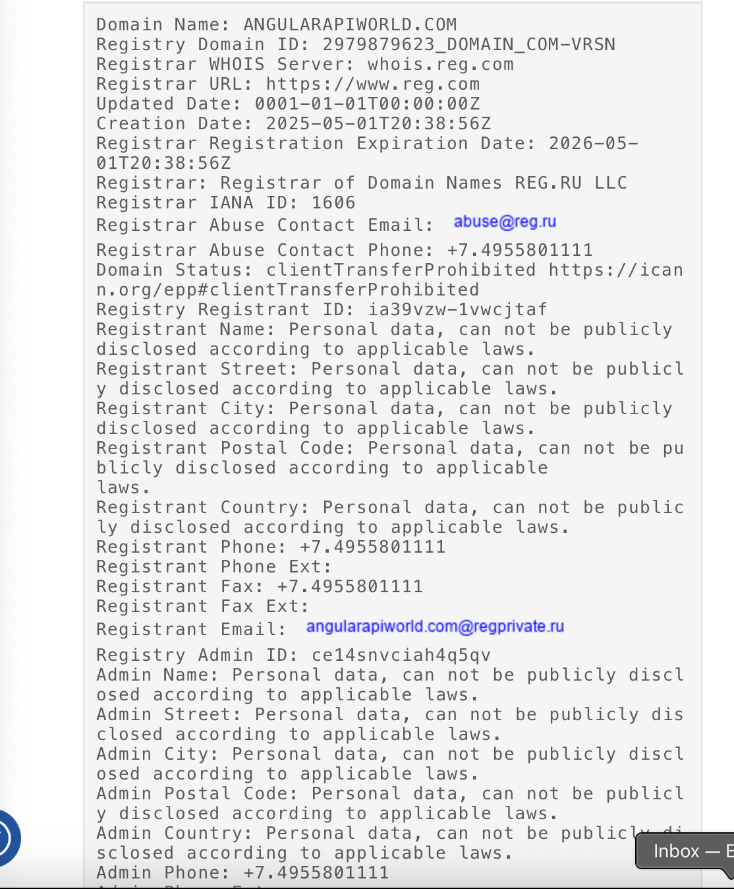

# 🎯 PCAP Analysis – Fireworks Phishing Investigation

## 📝 INCLUDE COMMANDS USED PLEASE (FILTERS)

## 📌 What Happened

On Wednesday, June 25, 2025, at 12:02:43 PM, SentinelOne flagged a suspicious email that was sent internally. Within Microsft Defender we were able to view more in depth of what was flagged and what happened within our proxy server we have here at the department. The email appeared to promote fireworks safety, linking to the site `mysafela[.]org/fireworks`. 

With the help of ANY.RUN we were able to use a sandboxed enviroment to simulate use on the website. At first glance, the site looked legitimate and displayed normal public content. There were no immediate red flags in the page when it was initially loaded. However, after normal use on the page, there was two possible sudden behavior changes. One being A fake security pop-up appeared, claiming the user's PC was infected and for the user to call a phone number. Then within this pop-up, scareware-style audio played to simulate urgency. Or the second outcome being a microsoft page urging to update the users browser. Below you can see the two scenarios from a users standpoint. 

Our team believed that this was a **delayed JavaScript-based redirect**, allowing the initial link to pass casual inspection or sandboxing if not monitored long enough. This would essentially be a form of **social engineering**, aiming to scare the user into taking further action.

---

## 🧪 How I Investigated It

To better understand the network behavior behind this redirect, I downloaded the PCAP file generated during the Any.run sandbox session. Since the traffic reflects interaction with a public site in an isolated environment (not internal systems), For people who would like to view the pcap file for their own use, it will be provided below.
[View the PCAP Traffic Capture](evidence/fireworks-incident.pcap)

### 🔎 Initial Packet Review
Using Wireshark I first reviewed all **HTTP GET and POST requests**, but they didn’t reveal anything meaningful — likely because the site switched over to encrypted traffic soon after the page loaded. The HTTP traffic looked relatively normal and didn't show any immediate signs of injection or unusual parameters. Here is what I saw. 

However, when I examined the **TLS traffic**, I found much more activity and a longer list of external domains. This included suspicious certificate exchanges and encrypted sessions that were established shortly after the pop-up appeared. Here is what I saw. 

### 🧪 Wireshark Filters Used
- `http.request.method == "GET"` – to extract visible GET requests
- `tls.handshake.type == 1` – to identify Client Hello (SNI field visibility)
- `dns` – to review all domain name resolution traffic
- 
---

## 🌐 Domain Discovery via TLS Traffic

I extracted that list of domains and IPs observed during the TLS sessions. I was able to use this filter,""  and from there I was able to make the inference that this suspicoious traffic was happening on the internal side of the HTTPS traffic. And with that the website mysafela didn't have any suspicious traffic occuring on their HTTP protocol. We know this is true becuase most malware now days have advanced their way into better tech in order for it to cross over into the more secure protocol. These appeared in **Server Name Indication (SNI)** fields, certificate metadata, or were contacted as part of redirects.

Here is the list of domains I identified. Given that they were all making traffic with, it was a must I know who they are and if they have any history of malicious like traffic. If so we could then proceed with eliminating them from acess reach within our LAPD network. For the sites that didn't come back with rating above one, I choose to not investigate further. Below also is a list of ratings, and critical information provided to us by "http://whois.domaintools.com", and "virustotal.com".

**mysafela[.]com**

**cdn-cookieyes[.]com**

**log.cookieyes[.]com**

**virtual.urban-orthodontics[.]com**

**skillboxultra[.]live**

**iff3m7wb.technestle[.]icu**

**visatayey.z19.web.core.windows[.]net**

**iplogger[.]co**

**ipwho[.]is**

**apiip[.]net**

**angularapiworld[.]com**

## ✅ What Was Analyzed and Final Resolution

With the help of Wireshark and ANY.RUN, we determined that the APT (Advanced Persistent Threat) associated with a user accessing mysafela.org was linked to `angularapiworld[.]com`. During domain analysis, I noticed most of the suspicious traffic originated from Australia, and one domain was traced back to Kazakhstan. This raises a red flag — when domains are communicating from regions far removed from the intended destination (especially without clear business relevance), it’s worth questioning their purpose.

Moving forward, we’ve blocked all suspicious domains that initiated communication within the captured traffic. While this incident didn’t result from intentional actions by the officer, the best course is to remind staff: always double-check links and files before sharing them internally. Verifying safety before distributing content across the LAPD network is key.

To wrap up this report, we emphasized the following:
- **What We Analyzed**: Suspicious domains, TLS handshakes, and GET requests from the PCAP file.
- **What We Will Do**: Block known malicious domains and document findings in internal logs.
- **What We Will Now Practice**: Promote greater awareness and validation of links across staff communications.

As for frameworks: this investigation was conducted using best practices from the **NIST 800-61** Incident Response Guide.

